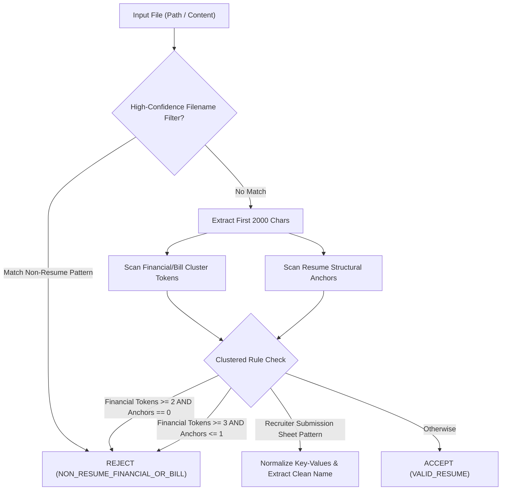

# Multi-Signal Document Classification Improvements

**Status:** `OPEN / READY FOR IMPLEMENTATION`  
**Priority:** High  
**Prerequisites:** Issue #12 (Unified Intake Pipeline)  

---

## 1. Problem Statement

In bulk ingestion folders, non-resume files such as utility bills (`UtilityBill.pdf`), bank statements (`082525 WellsFargo.pdf`), tax forms (`W2_2023.pdf`), and recruiter candidate submission sheets (`Bhargavi submission details.docx`) bypassed the pre-intake classifier and created garbage candidate records (e.g. candidate name `"Paid By Draft"` with phone number `1-800-CITY-BILL`).

A naive single-word blacklist (e.g. rejecting any document with `"balance"` or `"account"`) is unacceptable because it would reject genuine financial analysts, accountants, and billing specialists.

---

## 2. Target Files & Architecture

| File | Changes Required |
|---|---|
| `src/candidate_intelligence_platform/ingestion/intake.py` | Upgrade `classify_document()` with multi-signal clustered heuristics, anchor verification, and candidate form normalization. |
| `tests/test_intake.py` | Add unit tests with synthetic utility bills, bank statements, W2 forms, and genuine accountant resumes. |

---

## 3. Detailed Technical Specification

### 3.1 Multi-Signal Classification Flow



### 3.2 Stage 1: High-Confidence Filename Filtering & Safe Verification

Filter filenames before reading document bytes:

```python
FINANCIAL_BILL_FILENAME_PATTERNS = re.compile(
    r"(?:"
    r"utility[_\-\s]*bill|"
    r"bank[_\-\s]*statement|"
    r"statement[_\-\s]*of[_\-\s]*account|"
    r"pay[_\-\s]*stub|"
    r"pay[_\-\s]*slip|"
    r"w[\-\s]?2[_\-\s]*form|"
    r"1099[_\-\s]*(?:misc|nec|form)?|"
    r"tax[_\-\s]*return|"
    r"electricity[_\-\s]*bill|"
    r"water[_\-\s]*bill|"
    r"gas[_\-\s]*bill|"
    r"internet[_\-\s]*bill|"
    r"credit[_\-\s]*card[_\-\s]*statement"
    r")",
    re.IGNORECASE,
)
```

**Safe Verification Rule**: If filename matches `FINANCIAL_BILL_FILENAME_PATTERNS`, check first 1,000 characters of text for resume anchors (`"experience"`, `"education"`, `"skills"`).
- If anchors $== 0 \rightarrow$ reject immediately as `SKIPPED_NON_RESUME`.
- If anchors $\ge 2 \rightarrow$ treat as genuine resume (e.g. `John_Contractor_Resume.pdf`).

### 3.3 Stage 2: Clustered Body Heuristics vs Resume Anchors

Scan the first 2,000 characters of parsed document text:

1. **Financial / Billing Tokens ($N_{\text{fin}}$)**:
   - `"amount due"`, `"past due amount"`, `"total balance"`, `"previous balance"`, `"billing date"`, `"service address"`, `"service period"`, `"paid by draft"`, `"account number"`, `"statement of accounts"`, `"remit payment"`, `"payment due date"`, `"meter reading"`, `"kw/h"`, `"gross pay"`, `"net pay"`, `"federal income tax"`, `"social security wages"`.

2. **Resume Structural Anchors ($N_{\text{anchor}}$)**:
   - `"experience"`, `"work history"`, `"employment history"`, `"professional experience"`, `"education"`, `"skills"`, `"technical skills"`, `"projects"`, `"certifications"`, `"summary"`, `"qualifications"`.

3. **Classification Decision Logic**:
   ```python
   def is_financial_or_bill(text: str) -> bool:
       text_lower = text[:2000].lower()
       
       # Count distinct financial tokens matched
       fin_matches = sum(1 for token in FINANCIAL_TOKENS if token in text_lower)
       
       # Count distinct resume section anchors matched
       anchor_matches = sum(1 for anchor in RESUME_ANCHORS if anchor in text_lower)
       
       # Strict cluster rejection: Strong bill signals without resume anchors
       if fin_matches >= 2 and anchor_matches == 0:
           return True
       if fin_matches >= 3 and anchor_matches <= 1:
           return True
           
       return False
   ```

*Protection for Finance Candidates*: An accountant resume containing `"managed account balance of $5M"` will match resume anchors (`"experience"`, `"skills"`, `"education"`, $N_{\text{anchor}} \ge 3$), easily passing the check.

### 3.4 Recruiter Submission Form Normalization & Contact Extraction

Vendor / client submission sheets (e.g. `Bhargavi submission details.docx`) often format candidate details in key-value tables:
- Pattern: `"Candidate Name:\tJohn Doe"`, `"Full Name:\tJane Smith"`, `"Visa:\tH1B"`, `"Rate:\t$70/hr"`.
- Strip table field prefixes (`"Candidate Name:"`, `"Full Name:"`, `"Name:"`) from candidate names before inserting into `Candidate.first_name` and `Candidate.last_name`.

**Candidate Email Resolution Hierarchy**:
1. **Explicit Key-Value Match (Primary)**: Extract email on line matching `r'(?:Candidate|Applicant|Consultant)\s*Email\s*[:\t]\s*([a-zA-Z0-9._%+-]+@[a-zA-Z0-9.-]+\.[a-zA-Z]{2,})'`.
2. **Top-Header Candidate Email (Fallback 1)**: If no explicit key label, extract first email found in the top 500 characters, ignoring agency/recruiter domain patterns (`@recruiting.com`, `@staffing.com`, `recruiter@`, `submissions@`).
3. **General Regex (Fallback 2)**: Fall back to standard regex email extractor if no agency noise detected.
4. **Tier 2 AI Inference (Fallback 3)**: If rule-based extraction finds 0 emails, pass resume text to Tier 2 LLM extractor (`extract_inferences()`) to infer candidate contact email.

### 3.4.1 Multi-Candidate Batch Document Rejection

If a vendor submission sheet or PDF table contains multiple distinct candidate entries (e.g. `Candidate 1: ...`, `Candidate 2: ...`):
- Reject document immediately with status: `SKIPPED_MULTI_CANDIDATE_BATCH`.
- Emit structured warning log:
  ```python
  logger.warning(
      "DOCUMENT_REJECTED_MULTI_CANDIDATE",
      filename=filename,
      reason="File contains multiple candidate profiles in a single document table; unsupported batch format",
      action="skipped_ingestion",
  )
  ```

### 3.5 System Logging on Rejection

When a non-resume document is rejected:
- Do NOT create `Candidate`, `ResumeVersion`, or vector records.
- Delete or bypass CAS storage.
- Record structured log:
  ```python
  logger.info(
      "DOCUMENT_CLASSIFIER_REJECTED",
      filename=filename,
      category="NON_RESUME_FINANCIAL_OR_BILL",
      reason="Matched 3 financial tokens and 0 resume anchors",
      action="skipped_ingestion",
  )
  ```

---

## 4. Verification & Testing Plan

### 4.1 Fast Unit Tests in `tests/test_intake.py` (< 1s)
- **Utility Bill Rejection**: Assert `UtilityBill (1).pdf` with `"amount due"`, `"service address"`, and `"billing date"` is skipped as `SKIPPED_NON_RESUME`.
- **Bank Statement Rejection**: Assert `082525 WellsFargo.pdf` with `"statement of accounts"` and `"total balance"` is skipped.
- **Accountant Resume Safety**: Assert a resume with `"Senior Accountant with experience in balance sheets, ledger accounts, and billing"` is accepted as `VALID_RESUME`.
- **Submission Sheet Parsing**: Assert `Submission_Details.docx` extracts candidate name cleanly without `"Full Name:"` prefix.
