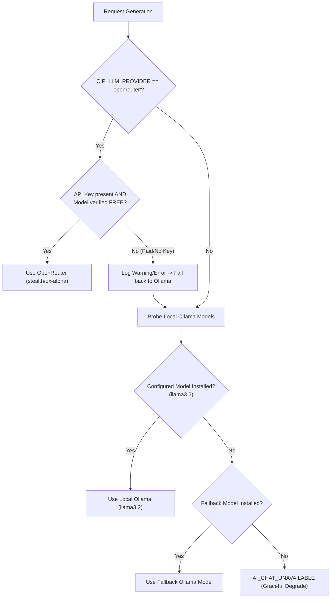

> 
> **ALREADY IMPLEMENTED** — This is already implemented and in codebase. Do NOT take this document as context / pending work unless user explicitly says otherwise.

# Switch LLM Backend to OpenRouter OX Alpha (Free Tier)

**Status:** `COMPLETED`  
**Implemented In:** `src/candidate_intelligence_platform/intelligence/chat_model.py`, `config/settings.py`  
**Tests:** `tests/test_model_fallbacks.py`, `tests/test_chat_model.py`  

---

## 1. Overview & Architectural Decisions

This feature introduces a configurable toggle allowing users to switch between local Ollama inference and OpenRouter cloud models for generation tasks (candidate match insights, job ad distillation, fallback extraction), while keeping embeddings 100% local.

### Key Rules Implemented:
1. **Local Embeddings Guaranteed**: FastEmbed / SentenceTransformers always run locally; vector embeddings are never sent to external APIs.
2. **Strict Free-Tier Guard**: OpenRouter model pricing is queried via `GET /api/v1/models`. If a model transitions from free to paid (or returns HTTP 402 Payment Required), it is instantly blacklisted, and requests fall back to local Ollama.
3. **Local Default**: `CIP_LLM_PROVIDER=ollama` remains the default provider. OpenRouter requires explicit configuration.

---

## 2. Configuration Schema

Configured via environment variables (`.env` or `config/settings.py`):

```bash
# Provider selection: "ollama" or "openrouter"
CIP_LLM_PROVIDER=ollama

# OpenRouter Settings (Active only when CIP_LLM_PROVIDER=openrouter)
CIP_OPENROUTER_API_KEY=sk-or-v1-...
CIP_OPENROUTER_MODEL=stealth/ox-alpha
CIP_OPENROUTER_BASE_URL=https://openrouter.ai/api/v1

# Local Ollama Settings (Default & automatic fallback)
CIP_LLM_MODEL=llama3.2
CIP_FALLBACK_LLM_MODEL=llama3.2
```

---

## 3. Resolution & Fallback Chain

`resolve_chat_model()` in `intelligence/chat_model.py` follows this strict priority:



---

## 4. Test Coverage & Verification

- `tests/test_chat_model.py`: Verifies resolution cache, pricing checks, and TTL expiry.
- `tests/test_model_fallbacks.py`: Verifies 402 Payment Required triggers instant fallback to Ollama with loud structured logging.