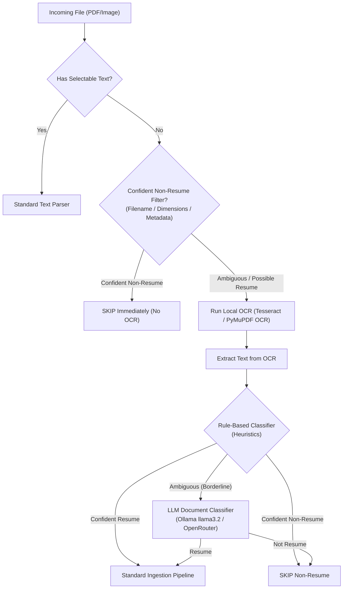

# Smart OCR & Multi-Stage Classification Pipeline

## Problem
In our dataset of candidate folders, 37 scanned PDFs and 20 standalone image files were skipped with `SCANNED_IMAGE_REQUIRES_OCR` or `STANDALONE_IMAGE`. Most of these files are non-resume support documents (Driver's Licenses, Passports, EAD cards, Visas, I-797 notices, Headshots).

Blindly running local CPU/GPU OCR on every scanned file wastes compute time (~1 second per page). Conversely, outright skipping all scanned PDFs means true scanned resumes (e.g. printed and scanned CVs) are missed entirely.

## Goal
Implement a cost-effective, multi-stage cascading pipeline that:
1. **Confidently pre-filters** obvious IDs/passports/visas by filename/metadata without running OCR.
2. **Runs OCR only on doubtful / potentially valid documents**.
3. **Uses LLM classification on post-OCR text** if heuristic confidence remains ambiguous.



---

## Multi-Stage Workflow Specification

### Stage 1: Fast Heuristic Pre-Filtering (Zero OCR Cost)
Before initializing OCR engines, evaluate:
- **Filename Matchers**:
  - Confident ID/Immigration patterns: `*dl*`, `*license*`, `*passport*`, `*visa*`, `*ead*`, `*i797*`, `*i94*`, `*green*card*`, `*gc*`, `*opt*card*`, `*state*id*`, `*utility*bill*`.
  - Confident Image Types: Small image dimensions ($< 600 \times 600$ px = profile avatar/signature) or landscape ID dimensions.
- **Decision**: If match is high confidence $\rightarrow$ Mark as `SKIPPED_NON_RESUME` (Category: `NON_RESUME_IMMIGRATION_OR_ID` or `STANDALONE_IMAGE`). **Zero OCR executed.**

### Stage 2: Selective OCR on Ambiguous Files
If a file has no selectable text layer but is NOT excluded by Stage 1:
- Run fast local OCR (e.g., Tesseract via `pytesseract` or PyMuPDF Tesseract engine) on the first 2 pages.
- Average processing speed: ~0.8s per page.
- Yields the raw extracted text.

### Stage 3: Post-OCR Heuristic Evaluation
Evaluate the OCR text against resume verification rules:
- Check for resume structural markers: Contact info, work history headings, educational qualifications, skill lists.
- If score $\ge 0.70 \rightarrow$ proceed to extraction as `VALID_RESUME`.
- If strong negative keywords found (e.g., `"Department of Homeland Security"`, `"Form I-797"`, `"Driver License"`) $\rightarrow$ Skip as `NON_RESUME`.

### Stage 4: AI LLM Fallback for Borderline Documents
If post-OCR text is noisy, partial, or ambiguous:
- Send prompt to local Ollama (`llama3.2`):
  ```
  Is the following document a candidate resume/CV, or is it a non-resume document (e.g., ID, visa, contract, invoice, assignment)?
  Respond with JSON: {"is_resume": true|false, "category": "...", "reason": "..."}
  ```
- If LLM confirms `is_resume: true` $\rightarrow$ proceed with entity resolution and candidate creation.
- If LLM confirms `is_resume: false` $\rightarrow$ reject document, purge CAS bytes, and record audit log.

---

## Expected Impact
- **90%+ Reduction in OCR Compute**: Skips OCR on dozens of ID cards, passports, and approval notices.
- **100% Coverage**: Never loses a genuine scanned resume.
- **High Precision**: The LLM acts as the ultimate tie-breaker for edge-case formats.
