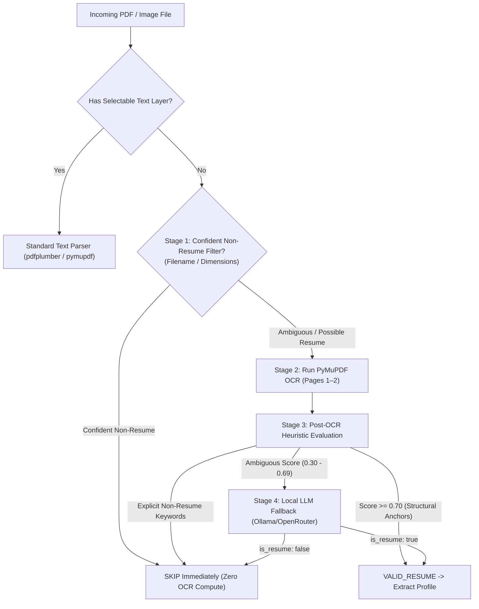

# Smart OCR & Multi-Stage Classification Pipeline

**Status:** `OPEN / READY FOR IMPLEMENTATION`  
**Priority:** Medium-High  
**Prerequisites:** Issue #12 (Unified Intake Pipeline)  

---

## 1. Problem Statement

In candidate folder bulk ingestion:
- 37 scanned PDFs and 20 image files were skipped with status `SCANNED_IMAGE_REQUIRES_OCR` or `STANDALONE_IMAGE`.
- Over 80% of these files are non-resume support documents (Driver's Licenses, Passports, EAD cards, Visas, I-797 approval notices, headshot photos).
- Blindly running CPU OCR on every scanned file wastes compute (~1s per page).
- Skipping all scanned files means real scanned paper CVs are permanently lost.

---

## 2. Target Files & Architecture

| File | Changes Required |
|---|---|
| `src/candidate_intelligence_platform/ingestion/parsers/pdf_parser.py` | Add lightweight PyMuPDF OCR fallback for scanned pages when selectable text is absent. |
| `src/candidate_intelligence_platform/ingestion/intake.py` | Implement 4-stage cascading classification before, during, and after OCR. |
| `src/candidate_intelligence_platform/prompts.py` | Add `build_document_classification_prompt()` for Stage 4 LLM fallback. |
| `tests/test_pdf_parser.py` | Unit tests with mock OCR outputs covering ID skips vs genuine scanned CVs. |

---

## 3. Detailed Technical Specification

### 3.1 4-Stage Cascading Workflow



### 3.2 Stage 1: Zero-Cost Heuristic Pre-Filtering

Before invoking any OCR engine, check filenames and image metadata:

```python
NON_RESUME_IMMIGRATION_PATTERNS = re.compile(
    r"(?:"
    r"driver[_\-\s]*licen[sc]e|dl[_\-\s]|state[_\-\s]*id|"
    r"passport|visa|ead|i[\-\s]?797|i[\-\s]?94|"
    r"green[_\-\s]*card|gc[_\-\s]|opt[_\-\s]*card|"
    r"work[_\-\s]*auth|ssn|social[_\-\s]*security|"
    r"offer[_\-\s]*letter|nda|agreement|contract"
    r")",
    re.IGNORECASE,
)
```

- **Filename Check**: If filename matches `NON_RESUME_IMMIGRATION_PATTERNS`, mark as `SKIPPED_NON_RESUME` (Category: `NON_RESUME_IMMIGRATION_OR_ID`). **0 ms OCR cost.**
- **Image Dimension Check**: If image dimensions are $< 600 \times 600$ px (avatar/headshot) or landscape ID aspect ratio ($85 \times 54$ mm ratio), skip immediately.

### 3.2.1 Lazy Pre-Flight OCR Engine Verification

Before running intake on the first scanned/image file:
- Probe PyMuPDF / Tesseract presence lazily (cached after first check).
- If OCR engine is not installed on host machine:
  - Halt scanned document processing immediately with structured status: `OCR_ENGINE_NOT_INSTALLED`.
  - Return clear error message: `"OCR engine not found on host. Install Tesseract-OCR to process scanned documents."`
  - Text-based PDFs continue processing normally without interruption.

### 3.3 Stage 2: Selective PyMuPDF OCR on Ambiguous Files

Use PyMuPDF's built-in Tesseract binding (`page.get_textpage_ocr()`) which avoids external CLI process spawning:

```python
def extract_text_with_ocr_fallback(pdf_bytes: bytes, max_pages: int = 2) -> tuple[str, bool]:
    """Extract text using native layer, falling back to OCR on first 2 pages if empty."""
    import fitz  # PyMuPDF
    
    doc = fitz.open(stream=pdf_bytes, filetype="pdf")
    full_text = ""
    is_ocr = False
    
    for i in range(min(len(doc), max_pages)):
        page = doc[i]
        text = page.get_text()
        if not text.strip():
            # Run OCR on page
            try:
                textpage = page.get_textpage_ocr(dpi=150, full=True)
                text = textpage.extractText()
                is_ocr = True
            except Exception as e:
                logger.error("pymupdf_ocr_failed_missing_engine", page=i, error=str(e))
                raise RuntimeError("OCR engine not available on host system")
        full_text += text + "\n"
        
    return full_text.strip(), is_ocr
```

### 3.4 Stage 3: Post-OCR Heuristics

Evaluate extracted OCR text against resume vs government document signals:
- **Strong Negative Tokens**: `"Department of Homeland Security"`, `"Form I-797C"`, `"UNITED STATES OF AMERICA"`, `"EMPLOYMENT AUTHORIZATION CARD"`, `"DRIVER LICENSE"`. If any match $\rightarrow$ skip as `NON_RESUME`.
- **Positive Resume Anchors**: Presence of contact info (email/phone) + experience/education sections. If score $\ge 0.70 \rightarrow$ proceed to extraction.

### 3.5 Stage 4: Local LLM Fallback

If post-OCR text is noisy or confidence is between 0.30 and 0.69, send first 1,500 characters to LLM using `prompts.py`:

```python
def build_document_classification_prompt(text_sample: str) -> str:
    return (
        "You are a document classifier. Determine if the following text comes from a candidate resume/CV "
        "or a non-resume document (e.g. ID card, visa, passport, bill, contract).\n\n"
        f"Document text snippet:\n\"\"\"\n{text_sample[:1500]}\n\"\"\"\n\n"
        "Respond ONLY with a valid JSON object:\n"
        '{"is_resume": true|false, "category": "RESUME"|"ID"|"VISA"|"BILL"|"OTHER", "confidence": 0.0-1.0}'
    )
```

---

## 4. Verification & Testing Plan

### 4.1 Mocked Fast Unit Tests (`tests/test_pdf_parser.py`)
- Test Stage 1 pre-filter on `passport_scan.pdf` $\rightarrow$ verifies OCR function is never called.
- Test Stage 2 PyMuPDF OCR mocked output on scanned CV text $\rightarrow$ verifies text extraction.
- Test Stage 3 heuristic rejection on Form I-797 snippet $\rightarrow$ verifies clean skip.
- Test Stage 4 LLM fallback prompt construction with snapshot assertions in `tests/test_prompts.py`.
